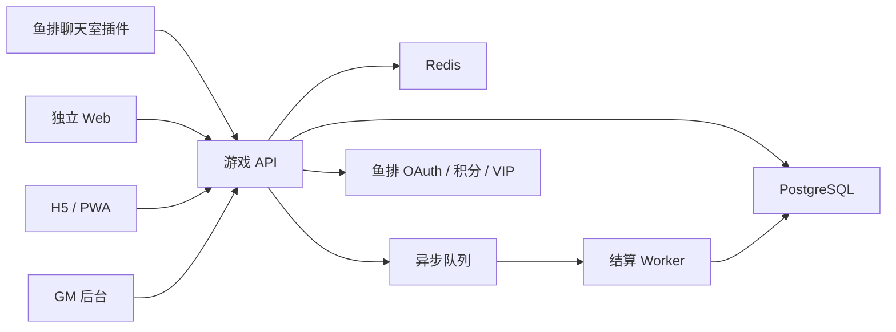

# 《择日飞升：九塔封魔》技术实现方案 v0.2

## 一、定位

本文定义三端技术实现方案：鱼排聊天室右侧插件、独立 Web 站点、独立 App 或移动端 H5。方案基于当前产品约束：Web 优先、共享 Web 核心、鱼排账号优先、全栈 TypeScript、PostgreSQL + Redis、移动端 H5/PWA 优先。

设计目标：

- 一套后端服务支撑三端。
- Web 和 H5 共享主要前端代码。
- 鱼排插件承载中等复杂随身面板，不复制完整游戏。
- 鱼排积分、VIP、OAuth、订单、月卡由服务端统一处理。
- 未来可从 H5/PWA 平滑升级为 App 壳。

## 二、三端定位

| 端 | 定位 | 首版范围 |
| --- | --- | --- |
| 鱼排聊天室右侧插件 | 中等复杂随身面板 | 修行状态、今日任务、洞府轻操作、九州/九塔摘要、预设行动、简化战报、PVP 提醒、古宝赠抽提醒、宗门提醒、跳转 Web/H5 |
| 独立 Web 站点 | 完整主体验 | 九州地图、修行、洞府、九塔、宗门、PVP、抽卡、月卡、背包、任务、排行 |
| 移动端 H5 / PWA | 移动主体验 | 复用 Web 核心页面，优化移动导航、一键操作、消息提醒 |

鱼排插件不做：

- 完整九州大地图和多层筛选。
- 完整战斗回放、技能逐帧表现和深度战报分析。
- 完整宗门管理、职位审批、仓库深层操作。
- 交易行深页、复杂价格分析和批量挂单。
- 大量抽卡动画、付费订单复杂处理和 GM / 配置发布。
- 服务端结算逻辑、抽卡随机、战斗判定和奖励发放。

插件负责 30 分钟日常中 60%-70% 的高频轻操作，完整体验由 Web/H5 承接。

## 三、推荐技术栈

| 层 | 技术 |
| --- | --- |
| Web / H5 | Next.js + React + TypeScript |
| UI | Tailwind CSS + 轻量组件库 |
| 鱼排插件 | TypeScript + Vue/TSX 组件，编译为扩展 JS + CSS，挂载到鱼排右侧面板 |
| 后端 API | NestJS 或 Fastify + TypeScript |
| 数据库 | PostgreSQL |
| 缓存 / 队列 | Redis |
| ORM / 查询 | Prisma 或 Drizzle，优先选择团队熟悉方案 |
| 后台 | 复用 React 管理端 |
| 部署 | Docker Compose 起步，后续拆 Kubernetes 或云服务 |
| 监控 | 日志、指标、错误追踪先接入基础方案 |

默认建议：

- 前端：Next.js App Router。
- 后端：NestJS，适合模块化和后台接口。
- ORM：Prisma，优先提高开发速度。
- 队列：BullMQ + Redis，用于异步行动、排行结算、邮件、订单补偿。

## 四、代码仓库结构

推荐使用 monorepo。

```text
apps/
  web/              独立 Web 与 H5/PWA
  api/              游戏后端 API
  admin/            GM 后台
  fishpi-plugin/    鱼排聊天室右侧插件
packages/
  shared/           共享类型、常量、工具
  ui/               共享 UI 组件
  config-schema/    配置 schema 和校验
  game-client/      前端 API SDK
  game-rules/       可共享的展示层规则和枚举
docs/
  *.md              当前设计文档
```

共享原则：

- 业务结算逻辑只在后端。
- 前端共享类型、接口 SDK、枚举、展示组件。
- 插件复用 `game-client` 和少量 `ui`，不引入完整 Web 路由和大型状态树。
- 配置校验 schema 在后端、后台和配置发布流程共用。

## 五、整体架构



核心原则：

- 所有端只调用游戏 API。
- 鱼排积分扣减必须由服务端发起。
- 抽卡、战斗、奖励、贡献、任务完成均由服务端结算。
- 异步行动提交后写入队列，由 Worker 结算。
- 客户端只展示状态和提交意图。

## 六、账号与登录

账号策略：鱼排账号优先。

| 场景 | 规则 |
| --- | --- |
| 鱼排插件 | 使用鱼排页面登录态或可用的鱼排用户信息发起绑定 / 登录 |
| 独立 Web | 使用鱼排 OAuth 登录，首次登录创建游戏账号 |
| H5 / PWA | 使用鱼排 OAuth 登录，支持保存登录态 |
| 开发环境 | 支持模拟鱼排账号和模拟 VIP |

登录流程：

1. 客户端请求游戏服务获取鱼排 OAuth 地址。
2. 用户授权后回到游戏服务。
3. 游戏服务绑定 `fishpi_user_id`。
4. 游戏服务签发游戏 JWT。
5. 客户端使用游戏 JWT 调用游戏 API。

插件登录特殊处理：

- 插件可以读取鱼排宿主提供的用户信息时，优先走静默绑定或短授权。
- 如果无法可靠取得 API Key 或 OAuth 状态，则展示“打开 Web 完成绑定”。
- 插件不保存鱼排敏感凭证，只保存游戏短期 token 或刷新状态。

## 七、鱼排插件方案

鱼排插件参考 `FishPiOffical/extension` 的扩展形态实现：运行在鱼排网页中，使用 JS/CSS 注入 UI。APP 扩展文档还提供 app-extension/app-theme 的分发接口，支持宿主按用户 ID 拉取已启用扩展，并通过 JS URL 加载应用扩展。

根据鱼排复杂界面扩展开发指南，插件可以采用响应式框架开发复杂界面。推荐使用 `index.ts` 和 `module.ts` 双入口：发布入口直接调用激活函数，调试入口导出 `activate(window, document, fishpi)`；运行时创建独立 DOM 容器并执行 `mount(container, fishpi)`。Vue 可通过 CDN 或构建外部化方式引入，减少扩展体积。

插件首版功能：

| 功能 | 说明 |
| --- | --- |
| 修行总览 | 境界、修为、追赶加成、离线收益、行动令、突破提示 |
| 今日日课 | 今日任务、周常摘要、章节任务摘要、可领取奖励 |
| 洞府轻操作 | 一键收菜、设施摘要、派遣完成提醒、保留材料策略提示 |
| 九州轻地图 | 九州列表、当前州状态、可参与资源点、主线进度摘要 |
| 九塔行动面板 | 保存预设、提交镇封/破封/补给等行动、查看今日贡献 |
| 简化战报 | 最近战斗、PVP 防守结果、复仇提醒、异常收益衰减提示 |
| 古宝提醒 | 月卡赠抽剩余次数、古宝保底进度、太乙丹鼎可用次数 |
| 宗门提醒 | 宗门任务、集结、仓库申请状态、宗门战周期结算提醒 |
| 快捷入口 | 打开 Web/H5 的九州、战斗、抽卡、月卡、宗门、交易行页面 |
| 消息提示 | 成功、失败、风控、需登录、需跳转、接口维护 |

插件组件结构建议：

```text
fishpi-plugin/
  index.ts          发布入口，立即 activate
  module.ts         调试入口，导出 activate
  src/
    mount.ts        创建容器并挂载应用
    components/     状态卡、任务、九塔、提醒组件
    api/            插件专用 API SDK 包装
    styles/         前缀化样式，避免污染鱼排页面
```

运行约束：

- 插件使用独立根容器和样式前缀，避免影响鱼排聊天室原有 DOM。
- 插件 API 请求必须经过游戏服务端，不直接请求鱼排积分扣减或订单接口。
- 插件端只保存短期游戏登录状态、界面偏好和本地折叠状态。
- 插件中的一键操作必须展示操作摘要，稀有材料、付费道具、终局材料不得自动消耗。
- 插件出现异常时移除自身挂载容器或降级为 Web/H5 跳转，不阻塞聊天室使用。

插件技术约束：

- 不在插件内处理付费订单、抽卡随机和战斗结算。
- 不在插件内存储敏感凭证。
- 所有状态变更调用游戏 API 并携带幂等键。
- 插件 UI 可以是中等复杂面板，但必须控制体积、请求频率和渲染成本，不影响鱼排聊天室主体验。
- 插件失败时降级为跳转 Web/H5。

## 八、Web 与 H5/PWA 方案

Web 是首个完整 MVP 主体验。

Web 首版页面：

- 登录 / 绑定鱼排。
- 九州地图。
- 今日任务。
- 修行与突破。
- 洞府。
- 九塔行动。
- 战斗与战报。
- 宗门。
- PVP 资源点。
- 背包。
- 抽卡与九大古宝。
- 月卡与 VIP。
- 邮件公告。

H5/PWA 复用 Web 页面，但调整：

- 底部 Tab 导航。
- 九州地图简化为列表 + 小地图。
- 日常一键操作置顶。
- 战报和排行改为移动抽屉。
- 支持添加到主屏幕。

暂不做原生 App。等 H5/PWA 验证后，再考虑 Capacitor 打包。

## 九、后端服务模块

| 模块 | 职责 |
| --- | --- |
| AuthModule | 鱼排 OAuth、游戏 JWT、账号绑定 |
| PlayerModule | 角色、进度、境界、追赶 |
| InventoryModule | 背包、货币、日志 |
| ActionModule | 行动令、异步行动提交 |
| CombatModule | 自动战斗、战报、镜像防守 |
| ProvinceModule | 九州、州状态、资源点 |
| TowerModule | 九塔、贡献、塔状态 |
| QuestModule | 日常、周常、章节、活动任务 |
| SectModule | 宗门、仓库、宗门任务 |
| PvpModule | 匹配、防骚扰、复仇、战报 |
| GachaModule | 卡池、保底、九大古宝 |
| PaymentModule | 鱼排积分订单、月卡、仙玉 |
| VipModule | 鱼排 VIP 查询和缓存 |
| MailModule | 邮件、补偿、公告 |
| ConfigModule | 配置加载、版本、校验 |
| AdminModule | GM 后台接口 |

异步 Worker：

- 行动结算。
- 战斗批量结算。
- 九塔日结 / 周结。
- 排行快照。
- 邮件批量发放。
- 订单补偿和对账。
- 经济监控报表。

## 十、数据与缓存

PostgreSQL 存储：

- 玩家、进度、背包、货币。
- 行动、战斗、九塔、宗门。
- 订单、抽卡、月卡、VIP 缓存。
- 任务、活动、排行、称号。
- GM、邮件、公告、配置发布。

Redis 用途：

- 会话与短期 token。
- 行动提交幂等锁。
- 队列。
- 高频榜单缓存。
- 鱼排 VIP 查询短缓存。
- 防刷计数和 PVP 冷却。

数据原则：

- 钱、物、订单、抽卡必须写 PostgreSQL 强记录。
- Redis 只做缓存、队列和限流，不作为唯一可信数据源。
- 配置版本随行动、战斗、抽卡、任务、订单记录写入。

## 十一、支付与鱼排积分

所有鱼排积分扣减由后端 PaymentModule 发起。

流程：

1. 客户端创建订单。
2. 服务端生成订单和幂等键。
3. 服务端请求鱼排扣积分。
4. 鱼排回调服务端。
5. 服务端校验签名、订单、玩家、商品、积分。
6. 服务端发放仙玉、月卡或权益。
7. 写订单日志、货币日志、GM 可查记录。

大额消费：

- 1024、4096、10240、32768、65536 积分仙玉包。
- 1 积分 = 1 付费仙玉。
- 大额包不额外赠送付费仙玉。
- 10 万到 50 万积分毕业目标在收藏和构筑深度，不突破 PVP 强度边界。

## 十二、MVP 开发顺序

第一阶段：Web + API 主循环。

- 鱼排 OAuth 模拟登录。
- 角色创建、修行、离线收益。
- 九州地图、普通探索、九塔行动。
- 自动战斗和战报。
- 任务、背包、洞府基础。

第二阶段：商业化和社交。

- 月卡、VIP、仙玉包模拟。
- 抽卡、九大古宝、保底。
- 宗门、PVP 资源点。
- 邮件、公告、GM 查询。

第三阶段：鱼排插件与 H5/PWA。

- 插件中等复杂随身面板、日课聚合、九塔预设、洞府轻操作、战报提醒、跳转入口。
- H5 移动导航和 PWA。
- 插件和 H5 共享 API SDK。

第四阶段：运营化。

- 配置发布。
- QA 自动化用例。
- 风控、对账、排行结算。
- 低活跃服和纪元结算预演。

## 十三、部署建议

MVP 部署：

- `web`：Node 服务或静态 + SSR。
- `api`：Node 服务。
- `worker`：独立 Node Worker。
- `postgres`：主数据库。
- `redis`：缓存和队列。
- `admin`：后台站点。

环境：

- `dev`：本地开发。
- `test`：测试服。
- `staging`：准生产，接鱼排模拟或沙箱。
- `prod`：正式服。

部署要求：

- 每次发布记录 Git commit、配置版本、数据库迁移版本。
- 订单、抽卡、货币相关发布必须先跑回归测试。
- 配置发布和代码发布分离。

## 十四、验收场景

- 独立 Web 能完成新手 30 分钟核心闭环。
- H5/PWA 能复用 Web 核心流程并适配移动端。
- 鱼排插件能在聊天室右侧展示修行、任务、洞府、九州、九塔、战报、古宝和宗门提醒，并完成一键领取与预设行动提交。
- 三端使用同一套游戏 API 和账号体系。
- 付费、抽卡、战斗、奖励均由服务端结算。
- 鱼排积分订单重复回调不会重复到账。
- 插件无法访问或服务异常时能降级到 Web/H5。
